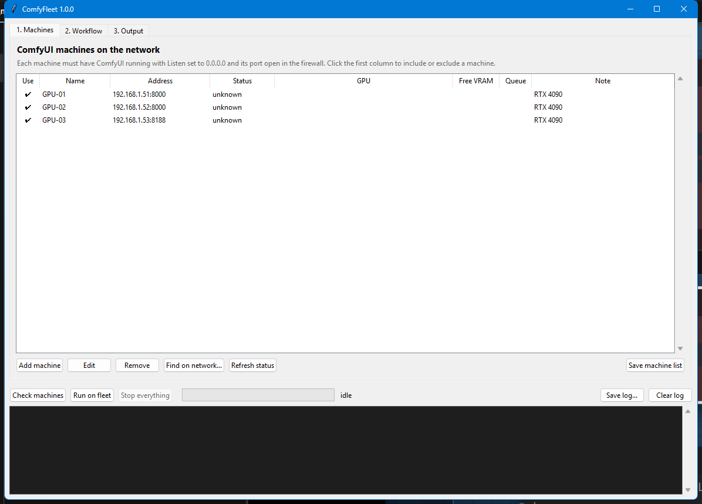
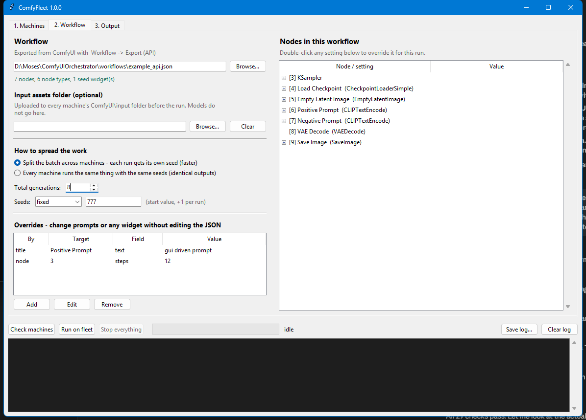
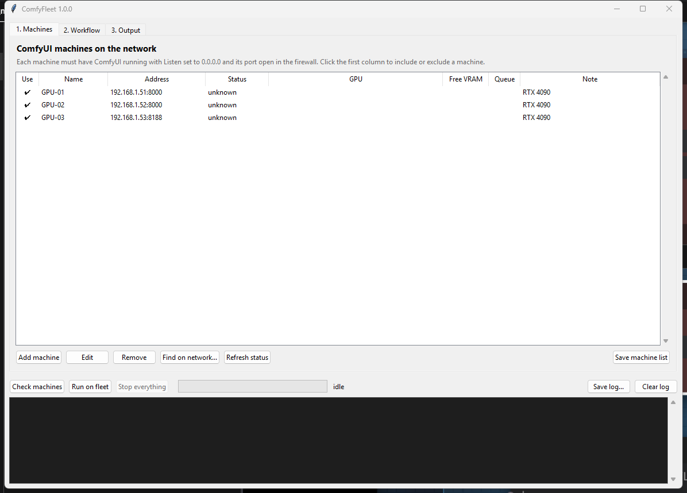

# ComfyFleet

Run one ComfyUI workflow across every GPU workstation on the LAN from a single console,
and pull all the outputs back to one shared folder.

**Double-click `ComfyFleet.cmd`** for the window, or use the command line:

```
cf status                     # who is online, what GPU, how deep is their queue
cf check  jobs/my-job.yaml    # do all machines have the nodes + models this workflow needs?
cf run    jobs/my-job.yaml    # push workflow + assets, dispatch, watch, collect outputs
cf cancel                     # stop everything everywhere
```

It talks to the HTTP API that every ComfyUI install already runs — Desktop, portable and
manual installs alike. Nothing has to be installed on the GPU machines.

## The window

Three tabs, then **Run on fleet**. Everything is saved, so it comes back the way you left it.

**1. Machines** — add each ComfyUI box by IP address and port, or press *Find on network…*
to scan the subnet and pick from what answers. The tick in the first column decides who takes
part; *Refresh status* shows each machine's GPU, free VRAM and queue depth.



> **Input files vs. models.** If your workflow loads a video, reference image or audio clip, that
> file has to exist on every machine. Add it with *Add files…* on the Workflow tab and it is
> uploaded before each run. Models are the opposite — too big for the API, so they are synced
> separately (see below). Preflight tells you which of the two is missing, by name.

**2. Workflow** — pick the exported `.json`, and the panel on the right lists every node with
its settings. Double-click any setting to override it for this run (prompt text, steps, cfg,
resolution…) without editing the file. Choose whether to split the batch across the fleet or
mirror the same run everywhere, how many generations, and how seeds are handled.



**3. Output** — where the finished files are gathered: a LAN share such as
`\\FILESERVER\ComfyOutputs`, or any folder on this computer. *Export job file…* saves the whole
setup so it can be re-run later from a script or a scheduled task with `cf run <file>`.



The log at the bottom is live while a run is going: which machine finished what, in how long,
and where the file landed. *Stop everything* clears the queues on all machines at once.

---

## What it does and does not do

**Does**

- Sends the exact same workflow graph (all nodes, wiring, widget values) to every machine.
- Uploads input assets (reference images, video, audio, masks) into each machine's `input/` folder.
- Overrides prompts and any other widget value per job, without editing the JSON.
- **shard** mode: splits N generations across the fleet with a distinct seed each — 5 machines
  finish a 100-image batch roughly 5× faster. Work is handed out as machines free up, so a
  4090 naturally takes more tasks than a 3060.
- **mirror** mode: every machine runs the identical workflow with identical seeds — for
  validating that the fleet is truly in sync.
- Downloads every produced file (images, videos, audio — anything a save node emits) to a LAN
  share, sorted per run and per machine, with a `run.json` manifest recording seed, machine,
  prompt id and file size for each.
- Survives a machine dropping out mid-run: its unfinished work is requeued to the others.

**Does not**

- Split a *single* image or video across GPUs. One generation runs on one GPU — that is a
  ComfyUI/model limitation, not this tool's. Parallelism here is per-generation.
- Copy checkpoints, LoRAs, VAEs or custom node code. Those are gigabytes and live outside the
  API. `cf check` tells you exactly which machine is missing what; `tools/Sync-Models.ps1`
  mirrors them from a master share.
- Install or launch ComfyUI. It must already be running on each machine.

---

## 1. Prepare each GPU machine (once)

By default ComfyUI listens on `127.0.0.1` only, so nothing outside that machine can reach it.
Two changes are needed.

**a) Make the server listen on the network**

- *ComfyUI Desktop*: Settings (gear) → **Server-Config** → set **Listen** to `0.0.0.0`,
  note the **Port** (Desktop defaults to `8000`), then restart ComfyUI Desktop.
- *Portable / manual*: launch with `python main.py --listen 0.0.0.0 --port 8188`.

**b) Open the port in Windows Firewall**

In an elevated PowerShell on that machine:

```bash
powershell -ExecutionPolicy Bypass -File \\FILESERVER\ComfyFleet\tools\Enable-ComfyRemote.ps1 -Port 8000
```

The script adds an inbound rule scoped to the local subnet and prints the machine's IP
addresses plus a `curl` line to verify with.

> Only do this on a trusted internal network. The ComfyUI API has no authentication — anyone
> who can reach the port can queue jobs and read outputs. Keep the firewall rule scoped to
> your subnet and never forward the port to the internet.

**c) Give the machines fixed addresses.** DHCP reservations or hostnames both work — the
config accepts either.

---

## 2. Prepare the console machine (once)

This can be any PC on the LAN, including one of the GPU boxes.

```bash
pip install -r requirements.txt
```

Then double-click **ComfyFleet.cmd** and work through the three tabs — that is the whole setup.
The rest of this section covers the command-line equivalent, which the window writes to the
same files.

Find the machines and write them into the config:

```bash
cf discover 192.168.1.0/24
```

That scans ports 8000/8188/8189 and prints a ready-to-paste `machines:` block. Put it in
[config/nodes.yaml](config/nodes.yaml) and set `collect.destination` to your share:

```yaml
collect:
  destination: '\\FILESERVER\ComfyOutputs'
  layout: '{run_id}/{machine}/{filename}'
```

Check it:

```bash
cf status
```

---

## 3. Get the models and nodes in sync

A workflow only runs where its checkpoints, LoRAs and custom nodes exist. Put one master copy
on a share (`\\FILESERVER\ComfyMaster\models`, `...\custom_nodes`) and mirror it to each
machine:

```bash
powershell -ExecutionPolicy Bypass -File tools\Sync-Models.ps1 -Source \\FILESERVER\ComfyMaster -Target "C:\Users\me\Documents\ComfyUI" -IncludeCustomNodes
```

Models must sit at the **same relative path** everywhere (`models/checkpoints/foo.safetensors`),
because that relative name is what the workflow stores.

Custom nodes also need their Python dependencies — after copying `custom_nodes`, open ComfyUI
once on that machine and let ComfyUI Manager install requirements.

*Alternative*: point every machine at the share directly via `extra_model_paths.yaml` instead
of copying. Simpler to maintain, but each model load then streams over the network — on 1 GbE
a 6 GB checkpoint takes about a minute the first time. Local copies are worth the disk.

Verify parity at any time:

```bash
cf check jobs/example.yaml
```

It reads `/object_info` from every machine and reports missing custom nodes and missing model
files, per machine, by name.

---

## 4. Export the workflow

In ComfyUI: **Workflow → Export (API)**. This is not the same as "Save" — the API format is a
flat map of nodes with `class_type`, which is what the queue endpoint accepts. A normal saved
workflow will be rejected with a message telling you so.

Drop the file in `workflows/`.

---

## 5. Write a job

A job is the workflow plus how many times to run it and what to change each run — see
[jobs/example.yaml](jobs/example.yaml):

```yaml
name: campaign-a
workflow: ../workflows/campaign_api.json

assets:
  - ../assets                 # uploaded to every machine's input/ folder

mode: shard                   # shard | mirror
count: 200                    # shard: total runs. mirror: runs per machine
seed: random                  # int (base, +1 per task) | random | keep

overrides:
  - title: "Positive Prompt"  # select by node title, id, or class
    field: text
    value: "a cinematic portrait of a lighthouse keeper, volumetric fog, 85mm"
  - node: "3"
    field: steps
    value: 30
```

Selectors: `node: "3"` (id from the API JSON), `title: "Positive Prompt"` (the node's title in
the graph), or `class: "KSampler"` (every node of that class). A shorthand mapping also works:
`overrides: {"6.text": "hello"}`.

---

## 6. Run it

```bash
cf run jobs/campaign-a.yaml
```

What happens, in order: preflight-check every machine → upload assets → hand out tasks, keeping
`slots` (default 2) queued per machine so no GPU idles between jobs → poll for completions →
download each finished job's files immediately → print a per-machine summary.

```
  dispatching 200 task(s) across 5 machine(s)
  + GPU-03 finished task 4 in 11s -> ComfyFleet_00007_.png
  [42/200 done, 0 failed, 42 files] GPU-01:2  GPU-02:2  GPU-03:2  GPU-04:offline  GPU-05:2

Done in 481.6s  -  200/200 tasks ok, 0 failed, 200 file(s) collected
  GPU-01   47 ok  0 failed  avg 11s/task
  ...
Outputs: \\FILESERVER\ComfyOutputs\20260809-141058-campaign-a
```

Ctrl+C cancels the remote queues and interrupts the running jobs before exiting.

Useful flags: `--only GPU-01,GPU-02`, `--count 40`, `--mode mirror`, `--seed 12345`,
`--dest <path>`, `--dry-run`, `--no-collect`, `--strict` (abort unless every machine passes
preflight), `--skip-check`.

---

## Command reference

| Command | Purpose |
|---|---|
| `cf status [--only ...]` | Ping every machine: GPU, free VRAM, queue depth, ComfyUI version |
| `cf discover <range>` | Scan `192.168.1.0/24` or `192.168.1.10-60` and emit config YAML |
| `cf check <job>` | Report missing custom nodes / models per machine |
| `cf run <job>` | Dispatch, monitor, collect |
| `cf cancel [--only ...]` | Clear queues and interrupt running jobs |
| `cf free [--only ...]` | Unload models and free VRAM everywhere |
| `cf gui` | Open the window (same as ComfyFleet.cmd) |

Global: `--fleet <path>` to use a different fleet config (default `config/nodes.yaml`).

On Linux/macOS, or without the `.cmd` wrapper, use `python -m comfyfleet ...`.

---

## Testing without GPUs

`tools/mock_comfy.py` is a fake ComfyUI that speaks the same API and emits a small PNG per job.
Start a few on different ports, point a fleet config at `127.0.0.1`, and the whole pipeline —
discovery, preflight, sharding, collection, machine-failure requeue — can be exercised on one PC.

```bash
python tools/mock_comfy.py --port 8801 --name MOCK-01 --delay 3
```

---

## Troubleshooting

| Symptom | Cause |
|---|---|
| `cannot connect (ComfyUI not running, or still bound to 127.0.0.1)` | Step 1a not done, or ComfyUI not started |
| `no answer (host up but nothing listening, or blocked by the firewall)` | Firewall rule missing or wrong port |
| `is a UI workflow, not an API workflow` | Re-export with **Workflow → Export (API)** |
| `custom node not installed: X` | Install X on that machine via ComfyUI Manager, restart it |
| `'foo.safetensors' is not on this machine` | Copy the model to the same relative path under `models/` |
| `'clip.mp4' is not on this machine` | An **input** file, not a model: add it with *Add files…* on the Workflow tab, or drop it in that machine's `ComfyUI\input` |
| `rejected the workflow: node 1 (LoadVideo): file - Invalid video file: clip.mp4` | ComfyUI says that name does not resolve inside its `input` folder — same fix as the row above. The machine is fine; the run stops instead of blaming it |
| Outputs not appearing on the share | The console machine needs write access to the UNC path; check `collect_errors` in `run.json` |
| One machine much slower | Normal with mixed GPUs — shard mode already compensates; raise its `slots` if it idles |

## Layout

```
ComfyFleet.cmd            double-click to open the window
cf.cmd                    command line entry point
config/nodes.yaml         the fleet: machines, ports, output share
config/gui_state.json     what the window had open last time (created on exit)
jobs/*.yaml               one file per job
workflows/*.json          API-format exports from ComfyUI
assets/                   input files pushed to the machines
comfyfleet/gui.py         the window
comfyfleet/               the engine (client, preflight, runner, CLI)
tools/Enable-ComfyRemote.ps1   per-machine firewall + listen setup
tools/Sync-Models.ps1          mirror models/custom_nodes from a master share
tools/mock_comfy.py            fake ComfyUI for testing
```
