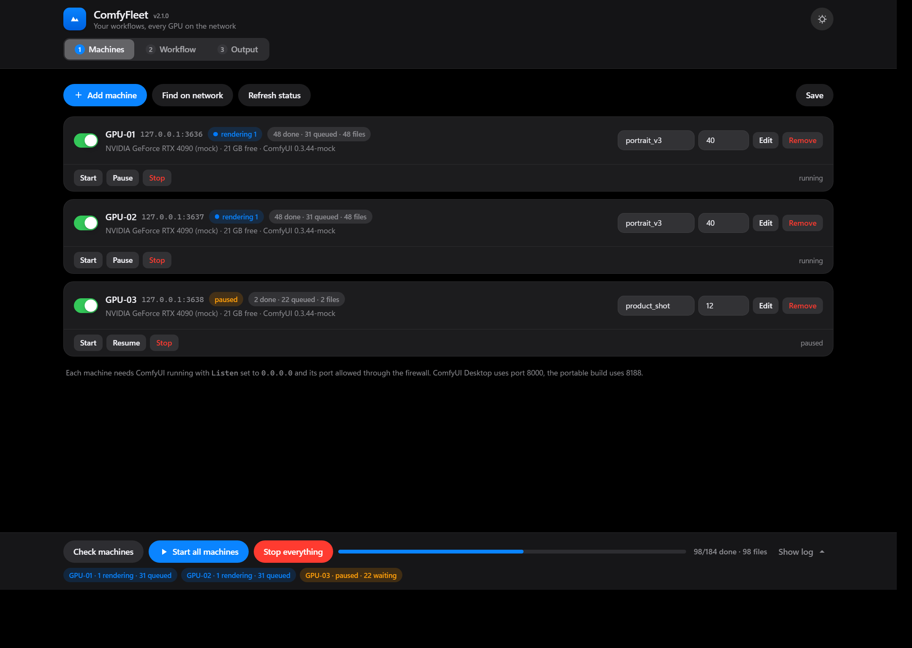
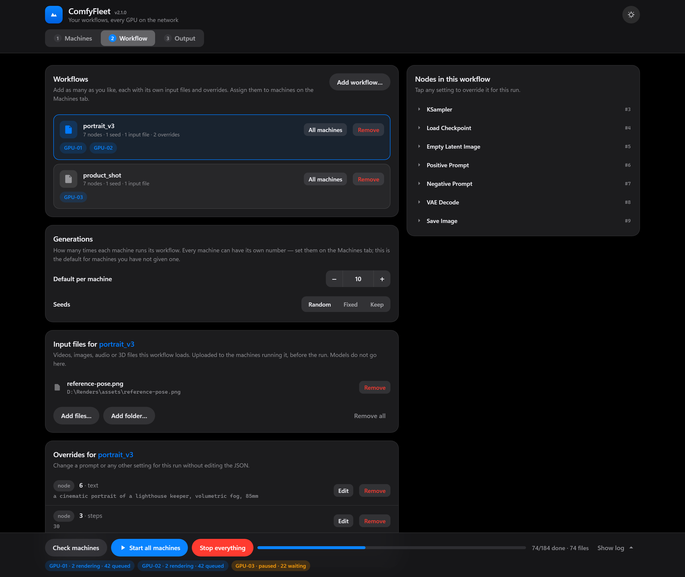
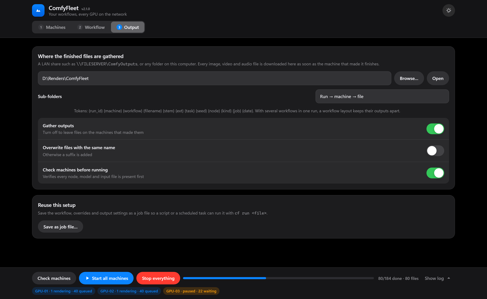
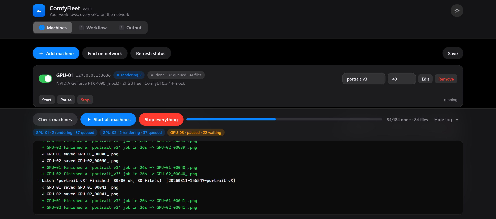

# ComfyFleet

Run your ComfyUI workflows across every GPU workstation on the LAN from one browser tab, and
collect the outputs to a single shared folder as they are produced.

```bash
npm start
```

Then open **http://localhost:8787**. There is nothing to install — no npm dependencies, no build
step. Node 20 or newer and the files in this folder are the whole thing.

It drives the HTTP API that every ComfyUI install already runs — Desktop, portable and manual
installs alike. Nothing has to be installed on the GPU machines themselves.

---

## The interface

Three tabs. Everything is saved, so it comes back the way you left it. The dock at the bottom
stays put wherever you are.

### 1. Machines



Add each ComfyUI box by address, or press *Find on network* to scan the subnet and pick from
whatever answers. Every row is that machine's own control panel:

- the **workflow** it runs,
- how many **generations** it should do,
- **Start / Pause / Resume / Stop** for that machine alone,
- live state while it works — rendering, queued, paused, not answering — and a tally of done,
  failed, cancelled and files collected.

Machines are independent. Starting one does not disturb the others, pausing one leaves the rest
rendering, and stopping one clears only its queue. You can add machines, add workflows and start
more work at any time, including while a render is in progress.

### 2. Workflow



Hold **as many workflows as you like**. Drop the exported `.json` files onto the page, or press
*Add workflow* and select several at once in the normal Windows file dialog.

Each workflow keeps its own **input files** and **overrides** — select one in the list and the
panels below (and the node inspector on the right) apply to it. Clicking any setting in the node
list creates an override for that workflow: prompt text, steps, cfg, resolution, without editing
the file. *All machines* puts one workflow on the whole fleet; *Remove* takes it out.

The **Generations** number here is the default; a machine with its own number on the Machines tab
uses that instead.

### 3. Output



Where finished files are gathered: a LAN share such as `\\FILESERVER\ComfyOutputs`, or any folder
on this computer. Files arrive **the moment the machine writes them**, not at the end of the
batch. *Save as job file* writes the whole setup out so a script or a scheduled task can run it
later with `cf run <file>`.

### The log



Every machine reports as it goes, streamed from the server. Each batch signs off with its own
summary, and every file says where it landed.

Light and dark follow the system; the button in the header cycles auto → light → dark. The
version badge next to the name tells you which build the page is running — handy after an update.
`#machines`, `#workflow` and `#output` open straight on that tab.

---

## What it does and does not do

**Does**

- Sends the exact workflow graph (all nodes, wiring, widget values) to every machine that runs it.
- Runs **a different workflow on each machine** in the same session, each with its own input files,
  overrides and generation count.
- Uploads input assets (reference images, video, audio, masks, 3D files) into each machine's
  `input/` folder before the run.
- Overrides prompts and any other widget value per workflow, without editing the JSON.
- Treats every machine as an independent worker: start, pause, resume or stop one without
  touching the rest, and queue more work onto a machine that is already busy.
- Downloads every produced file — images, videos, audio, anything a save node emits — **as soon as
  the machine writes it**, by listening on each machine's event socket. Outputs are sorted per
  batch and per machine, with a `run.json` manifest recording seed, machine, workflow, prompt id
  and size for each.
- Keeps working when a machine goes quiet: its queue is held, and it rejoins when it answers again.
- Tells you *why* a machine cannot run something — a missing custom node, a missing model or a
  missing input file — by name, before anything is queued.

**Does not**

- Split a *single* image or video across GPUs. One generation runs on one GPU; that is a
  ComfyUI/model limitation, not this tool's. The parallelism here is per-generation.
- Copy checkpoints, LoRAs, VAEs or custom node code. Those are gigabytes and live outside the API —
  `tools/Sync-Models.ps1` mirrors them from a master share.
- Install or launch ComfyUI. It must already be running on each machine.

---

## 1. Prepare each GPU machine (once)

By default ComfyUI listens on `127.0.0.1` only, so nothing outside that machine can reach it.

**a) Make the server listen on the network**

- *ComfyUI Desktop*: Settings (gear) → **Server-Config** → set **Listen** to `0.0.0.0`, note the
  **Port** (Desktop defaults to `8000`), restart ComfyUI Desktop.
- *Portable / manual*: launch with `python main.py --listen 0.0.0.0 --port 8188`.

**b) Open the port in Windows Firewall.** In an elevated PowerShell on that machine:

```bash
powershell -ExecutionPolicy Bypass -File tools\Enable-ComfyRemote.ps1 -Port 8000
```

It adds an inbound rule scoped to the local subnet and prints the machine's addresses.

> Only do this on a trusted internal network. The ComfyUI API has no authentication — anyone who
> can reach the port can queue jobs and read outputs. Keep the rule subnet-scoped and never forward
> these ports to the internet. The same applies to ComfyFleet's own interface, which binds to
> localhost unless you pass `--host`.

**c) Give the machines fixed addresses.** DHCP reservations or host names both work.

---

## 2. Start ComfyFleet

On any PC on the LAN, including one of the GPU boxes:

```bash
npm start
```

To reach the interface from another machine on the network:

```bash
node bin/cf.js web --host 0.0.0.0 --port 8787
```

**File dialogs.** *Add workflow*, *Add files* and *Browse* open the real Windows file dialog on the
machine running ComfyFleet — deliberately, since the paths have to make sense to the server rather
than to your browser. If you drive the interface from a different computer the dialog would open
on the server's screen where nobody can see it, so start the server with `COMFYFLEET_PICKER=off`
and it will ask you to type paths instead. It falls back to that automatically on a machine with
no desktop.

---

## 3. Keep models and custom nodes in sync

A workflow only runs where its checkpoints, LoRAs and custom nodes exist. Keep one master copy on
a share and mirror it to each machine:

```bash
powershell -ExecutionPolicy Bypass -File tools\Sync-Models.ps1 -Source \\FILESERVER\ComfyMaster -Target "C:\Users\me\Documents\ComfyUI" -IncludeCustomNodes
```

Models must sit at the **same relative path** everywhere (`models/checkpoints/foo.safetensors`),
because that relative name is what the workflow stores. Custom nodes also need their Python
dependencies — after copying `custom_nodes`, open ComfyUI once on that machine and let ComfyUI
Manager install requirements.

*Alternative*: point every machine at the share with `extra_model_paths.yaml` instead of copying.
Simpler to maintain, but each model load then streams over the network — on 1 GbE a 6 GB
checkpoint costs about a minute the first time. Local copies are worth the disk.

**Check machines** verifies all of this and names anything missing.

---

## 4. Export the workflow

In ComfyUI: **Workflow → Export (API)**. This is not the same as Save — the API format is a flat
map of nodes with `class_type`, which is what the queue endpoint accepts. A normal saved workflow
is rejected with a message telling you so.

---

## Input files vs. models

If a workflow loads a video, reference image, audio clip or 3D file, that file has to exist on
every machine that runs it. Add it under **Input files** for that workflow and it is uploaded
before the run. Models are the opposite — too big for the API, so they are synced separately.
Preflight tells you which of the two is missing, by name, and lists what the machine has instead.

---

## Where the files land

The **Sub-folders** setting is a template. Tokens:

| Token | Meaning |
|---|---|
| `{run_id}` / `{batch}` | one press of Start, e.g. `20260811-155547-portrait_v3` |
| `{machine}` | the machine that produced the file |
| `{workflow}` | the workflow it came from |
| `{filename}` `{stem}` `{ext}` | the name ComfyUI gave it |
| `{seed}` `{node}` `{kind}` | the seed used, the node that saved it, and what kind of output |
| `{job}` `{date}` | the job name and today's date |

With several workflows running at once, putting `{workflow}` in the template keeps their outputs
apart.

---

## Command line

The same engine, for scripts and scheduled tasks:

| Command | Purpose |
|---|---|
| `node bin/cf.js web [--port 8787] [--host 0.0.0.0] [--open]` | Open the interface |
| `node bin/cf.js status [--only A,B] [-v]` | Ping every machine: GPU, free VRAM, queue depth |
| `node bin/cf.js discover 192.168.1.0/24` | Scan the network and print config JSON |
| `node bin/cf.js check jobs/my-job.json` | Report missing nodes / models / inputs per machine |
| `node bin/cf.js run jobs/my-job.json` | Queue the job and wait for it to finish |
| `node bin/cf.js cancel [--only A,B]` | Stop every machine |
| `node bin/cf.js free [--only A,B]` | Unload models and free VRAM everywhere |

`run` also takes `--count N`, `--seed N|random|keep`, `--dest PATH`, `--only A,B`, `--no-collect`,
`--skip-check`, `--strict`, `--dry-run`, `--json FILE`.

A job file is what *Save as job file* writes — see [jobs/example.json](jobs/example.json):

```json
{
  "name": "campaign-a",
  "workflows": [
    { "id": "portrait", "path": "../workflows/portrait_v3.json",
      "assets": ["D:\\Renders\\assets\\reference-pose.png"],
      "overrides": [
        { "title": "Positive Prompt", "field": "text", "value": "a cinematic portrait, volumetric fog, 85mm" },
        { "node": "3", "field": "steps", "value": 30 }
      ] },
    { "id": "product", "path": "../workflows/product_shot.json" }
  ],
  "assignments": { "GPU-01": "portrait", "GPU-02": "portrait", "GPU-03": "product" },
  "count": 40,
  "seed": "random"
}
```

Override selectors: `"node": "3"` (id from the API JSON), `"title": "Positive Prompt"` (the node's
title in the graph), or `"class": "KSampler"` (every node of that class). A job with one workflow
and no `assignments` runs it on every machine.

---

## Settings and files

| Path | What it is |
|---|---|
| `config/nodes.json` | the fleet: machines, ports, output location |
| `config/ui-state.json` | what the browser had open last (written automatically) |
| `jobs/*.json` | saved jobs |
| `workflows/*.json` | API-format exports from ComfyUI |

Two environment variables change where things live:

- `COMFYFLEET_CONFIG=<folder>` — use a different config folder. The test suite uses this so a test
  run can never write over the fleet you actually use.
- `COMFYFLEET_PICKER=off` — never open native file dialogs; ask for typed paths instead.

---

## Testing without GPUs

`tools/mock-comfy.js` is a fake ComfyUI that speaks the same API, validates file names the way the
real one does, and emits a small PNG per job:

```bash
node tools/mock-comfy.js --port 8801 --name MOCK-01 --delay 3
```

The suite starts its own mocks plus the real web server and drives both the engine and the HTTP API
the way the browser does:

```bash
npm test
```

---

## Troubleshooting

| Symptom | Cause |
|---|---|
| `cannot connect (ComfyUI not running, or still bound to 127.0.0.1)` | Step 1a not done, or ComfyUI is not started |
| `no answer (host up but nothing listening, or blocked by the firewall)` | Firewall rule missing, or the wrong port |
| `This is a UI workflow, not an API workflow` | Re-export with **Workflow → Export (API)** |
| `custom node not installed: X` | Install X with ComfyUI Manager on that machine, restart it |
| `'foo.safetensors' is not on this machine` | Copy the model to the same relative path under `models/` |
| `'clip.mp4' is not on this machine` | An input file, not a model: add it under Input files, or drop it in that machine's `ComfyUI\input` |
| `rejected the workflow: node 1 (LoadVideo): file - Invalid video file: clip.mp4` | ComfyUI says that name does not resolve in its `input` folder — same fix as above. The machine is fine, so the run stops rather than blaming it |
| `this machine's ComfyUI does not offer 'x' for node N …` | That build genuinely lacks the option — usually an older or newer ComfyUI, or a different custom node version. To run regardless, switch off *Check machines before running* |
| `still running after N minutes - giving up on it` | Only time spent *executing* counts towards this, so queued work is never written off. Raise `fleet.stallTimeout` in `config/nodes.json` for very long videos |
| The file dialog does not appear | It opens on the machine running ComfyFleet. Driving the interface from another computer? Start the server with `COMFYFLEET_PICKER=off` |
| Outputs are not appearing | The machine running ComfyFleet needs write access to the destination; check `collectErrors` in `run.json` |
| A change did not take effect | Reload the page for anything under `public/`. Changes under `src/` need the server restarted (`npm start`) — the version badge in the header tells you what is loaded |

---

## Layout

```
bin/cf.js              command line entry point
src/fleet.js           the supervisor: one independent worker per machine
src/server.js          web server: JSON API + live event stream
src/client.js          the ComfyUI HTTP API and its event socket
src/preflight.js       node / model / input verification
src/workflow.js        API-workflow loading, inspection, patching
src/picker.js          native file dialogs
src/discover.js        LAN scan
src/config.js          fleet and job configuration
src/runner.js          shared helpers: asset lists, safe paths, manifests
public/                the interface: index.html, app.js, styles.css, vendored Tailwind
tests/run-tests.js     end-to-end tests
tools/mock-comfy.js            fake ComfyUI for testing
tools/pick.ps1                 the Windows file dialog helper
tools/Enable-ComfyRemote.ps1   per-machine firewall + listen setup
tools/Sync-Models.ps1          mirror models/custom_nodes from a master share
```

Tailwind is vendored in `public/vendor/` so the interface works with no internet access.
